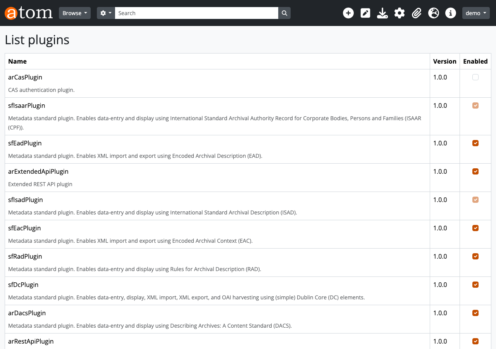

# AtoMのREST APIを拡張するプラグインを開発した話

## はじめに

[AtoM (Access to Memory)](https://www.accesstomemory.org/) は、アーカイブ機関向けのオープンソースWebアプリケーションです。ISAD(G)、ISAAR(CPF)、ISDFなどの国際標準に準拠した記述管理機能を提供しており、世界中の図書館・文書館・博物館で利用されています。

AtoMには `arRestApiPlugin` という標準のREST APIプラグインが同梱されていますが、以下の制約があります：

- **情報オブジェクト（資料記述）のCRUD** が中心で、カバー範囲が限定的
- **所蔵機関（Repository）**、**典拠レコード（Actor）**、**受入記録（Accession）** のAPIがない
- **タクソノミー**（分類語彙）の操作APIがない
- **デジタルオブジェクト**のアップロードAPIが実用的でない
- **機能記述（Function）** のAPIがない

これでは、外部システムとの連携やバッチ処理による大量登録といった業務ニーズに応えられません。

本記事では、これらの課題を解決するために開発した **arExtendedApiPlugin** の実装について解説します。

> このプラグインを使って実際に業務シナリオを実行した記事もあります：[APIで構築する図書館デジタルアーカイブ — AtoM業務シナリオ実践ガイド](blog-atom-api-scenario.md)

---

## arExtendedApiPlugin の概要

### エンドポイント一覧（全28エンドポイント）

| リソース | メソッド | エンドポイント | 説明 |
|----------|----------|----------------|------|
| サマリー | GET | `/api/summary` | 各エンティティの件数 |
| 所蔵機関 | GET | `/api/repositories` | 一覧（検索・ページネーション） |
| | GET | `/api/repositories/:slug` | 詳細取得 |
| | POST | `/api/repositories` | 新規作成 |
| | PUT | `/api/repositories/:slug` | 更新 |
| | DELETE | `/api/repositories/:slug` | 削除 |
| | POST | `/api/repositories/:slug/logo` | ロゴアップロード |
| | DELETE | `/api/repositories/:slug/logo` | ロゴ削除 |
| 典拠レコード | GET | `/api/actors` | 一覧 |
| | GET | `/api/actors/:slug` | 詳細取得 |
| | POST | `/api/actors` | 新規作成 |
| | PUT | `/api/actors/:slug` | 更新 |
| | DELETE | `/api/actors/:slug` | 削除 |
| 受入記録 | GET | `/api/accessions` | 一覧 |
| | GET | `/api/accessions/:slug` | 詳細取得 |
| | POST | `/api/accessions` | 新規作成 |
| | PUT | `/api/accessions/:slug` | 更新 |
| | DELETE | `/api/accessions/:slug` | 削除 |
| タクソノミー | GET | `/api/taxonomies` | 全タクソノミー一覧 |
| | POST | `/api/taxonomies/:id/terms` | 用語追加 |
| | PUT | `/api/taxonomies/terms/:id` | 用語更新 |
| | DELETE | `/api/taxonomies/terms/:id` | 用語削除 |
| 機能記述 | GET | `/api/functions` | 一覧 |
| | GET | `/api/functions/:slug` | 詳細取得 |
| | POST | `/api/functions` | 新規作成 |
| | PUT | `/api/functions/:slug` | 更新 |
| | DELETE | `/api/functions/:slug` | 削除 |
| デジタルオブジェクト | POST | `/api/informationobjects/:slug/digitalobject` | アップロード |

> **Note**: 資料記述（Information Object）のCRUDは、既存の `arRestApiPlugin` が提供する `POST/GET /api/informationobjects` を使用します。

### アーキテクチャ

```
arExtendedApiPlugin/
├── config/
│   └── arExtendedApiPluginConfiguration.class.php  # ルーティング・プラグイン設定
└── modules/
    └── extapi/
        ├── actions/
        │   ├── summaryAction.class.php
        │   ├── repositories{Browse,Read,Create,Update,Delete}Action.class.php
        │   ├── repositoriesLogoUploadAction.class.php
        │   ├── actors{Browse,Read,Create,Update,Delete}Action.class.php
        │   ├── accessions{Browse,Read,Create,Update,Delete}Action.class.php
        │   ├── taxonomiesBrowseAllAction.class.php
        │   ├── taxonomyTerms{Create,Update,Delete}Action.class.php
        │   ├── functions{Browse,Read,Create,Update,Delete}Action.class.php
        │   └── digitalobjectsUploadAction.class.php
        └── config/
            ├── filters.yml
            └── security.yml
```

AtoMのプラグインは管理画面（Admin > Plugins）から有効化します。



---

## 実装の要点

### 1. プラグイン基盤：設定クラスとルーティング

AtoMのプラグインは `sfPluginConfiguration` を継承して作成します。arExtendedApiPlugin の設定クラスでは、`routing.load_configuration` イベントにフックしてルーティングを登録します。

```php
class arExtendedApiPluginConfiguration extends sfPluginConfiguration
{
    public static $summary = 'Extended REST API plugin';
    public static $version = '1.0.0';

    public function initialize()
    {
        // extapiモジュールを有効化
        $enabledModules = sfConfig::get('sf_enabled_modules');
        $enabledModules[] = 'extapi';
        sfConfig::set('sf_enabled_modules', $enabledModules);

        // ルーティングイベントにフック
        $this->dispatcher->connect(
            'routing.load_configuration',
            [$this, 'routingLoadConfiguration']
        );
    }
}
```

### 2. ルーティング優先度の問題と解決策

AtoMの `arRestApiPlugin` には、未知のAPIパスをキャッチする `api_endpointNotFound` というキャッチオールルートが存在します。symfonyのルーティングは先着順のため、通常の `routing.yml` でルートを追加しても、このキャッチオールルートが先にマッチしてしまいます。

**解決策**: `insertRouteBefore()` を使用して、キャッチオールルートの**手前**にルートを挿入します。

```php
protected function addRoute($method, $pattern, array $options = [])
{
    // ... (defaults, requirements の組み立て)

    // arRestApiPlugin のキャッチオールルートの手前に挿入
    $beforeRoute = $this->routing->hasRouteName('api_endpointNotFound')
        ? 'api_endpointNotFound'
        : 'slug/default';

    $this->routing->insertRouteBefore(
        $beforeRoute,
        $name,
        new sfRequestRoute($pattern, $defaults, $requirements)
    );
}
```

これにより、`/api/repositories` のようなリクエストが `api_endpointNotFound` に到達する前に、正しいアクションにルーティングされます。

### 3. CRUD アクションパターン

全アクションは `QubitApiAction` を継承します。HTTPメソッドに対応する `get()`、`post()`、`put()`、`delete()` メソッドをオーバーライドして実装します。

```php
class ExtapiRepositoriesCreateAction extends QubitApiAction
{
    protected function post($request, $payload)
    {
        // ACLチェック
        if (!QubitAcl::check(QubitRepository::getRoot(), 'create')) {
            throw new QubitApiForbiddenException();
        }

        // 必須フィールドの検証
        if (empty($payload->authorized_form_of_name)) {
            throw new QubitApiBadRequestException(
                'Missing required field: authorized_form_of_name'
            );
        }

        // エンティティの作成
        $repository = new QubitRepository();
        $repository->parentId = QubitRepository::ROOT_ID;
        $repository->sourceCulture = sfContext::getInstance()
            ->user->getCulture();

        // フィールドの一括処理
        foreach ($payload as $field => $value) {
            $this->processField($repository, $field, $value);
        }

        $repository->save();

        $this->response->setStatusCode(201);

        return [
            'id'   => (int) $repository->id,
            'slug' => $repository->slug,
        ];
    }
}
```

Update アクションは Create アクションを継承し、`processField()` メソッドを再利用します。

```php
class ExtapiRepositoriesUpdateAction extends ExtapiRepositoriesCreateAction
{
    protected function put($request, $payload)
    {
        $repository = QubitObject::getBySlug($request->slug);
        // ... ACLチェック、フィールド更新、save()
    }
}
```

### 4. デジタルオブジェクトアップロードの注意点

デジタルオブジェクトのアップロードで最もハマったポイントは、**`usageId` の設定**です。

```php
$digitalObject = new QubitDigitalObject();
$digitalObject->object = $io;
$digitalObject->usageId = QubitTerm::MASTER_ID;  // ← これが必須！
```

AtoMのデジタルオブジェクト処理パイプライン（`createRepresentations()`）では、`usageId` が `MASTER_ID` に設定されていることを前提に、参照用コピー（reference）とサムネイル（thumbnail）の自動生成を行います。

この設定を忘れると、以下のような不可解なエラーが発生します：

```
Got an orphaned derivative
```

既存の Web UI のアップロード処理（`multiFileUploadAction`、`addDigitalObjectAction`）を調べると、すべて `$digitalObject->usageId = QubitTerm::MASTER_ID` を設定しています。

---

## 開発中にハマったポイント

### 1. ルーティングが効かない — `endpointNotFound` に吸い込まれる

**症状**: 新しいAPIエンドポイントにアクセスすると、常に `{"id":"endpoint-not-found"}` が返る。

**原因**: `arRestApiPlugin` の `api_endpointNotFound` キャッチオールルートが先にマッチする。

**解決**: `insertRouteBefore('api_endpointNotFound', ...)` を使用。`routing.yml` ではなく、`routingLoadConfiguration` イベントハンドラで動的にルートを登録する。

### 2. デジタルオブジェクトアップロードで "orphaned derivative" エラー

**症状**: `QubitDigitalObject::save()` 時に `Got an orphaned derivative` エラー。

**原因**: `$digitalObject->usageId` を設定していなかったため、`createRepresentations()` 内の条件分岐で `MASTER_ID` チェックをスキップし、`$this->parent` のチェックに到達してエラー。

**解決**: `$digitalObject->usageId = QubitTerm::MASTER_ID;` を設定。AtoMのWeb UIのアップロード処理を参照すると、すべての箇所でこの設定が行われている。

### 3. タクソノミー用語IDの不一致

**症状**: `entity_type_id: 160` を指定したら、`entity_type: "Published"` と返される。

**原因**: 160 は `Publication Status > Published` の用語ID。Actor Entity Types の用語IDは 131-133 の範囲。タクソノミーIDと用語IDを混同していた。

**解決**: `GET /api/taxonomies` で全タクソノミー一覧を取得し、データベースから正確な用語IDを確認。

### 4. Browse APIで結果が空になる

**症状**: `POST` で作成直後に `GET /api/repositories` の `results` が空配列。`total` は正しいカウント。

**原因**: Browse アクションは Propel ORM を使ってデータベースに直接クエリするため、通常は即座に反映される。しかし、AtoMの一部のキャッシュ機構により、トランザクション完了のタイミングによっては一時的にズレが生じることがある。

**解決**: Read API（`GET /api/repositories/:slug`）で個別取得は常に最新データを返すため、作成直後の確認にはこちらを使用する。

### 5. Docker環境でのプラグイン有効化

AtoMのプラグインは通常 Web UI の「Admin > Plugins」画面から有効化しますが、Docker環境では以下のSQLで直接有効化できます：

```sql
INSERT INTO setting (name, scope, editable, deleteable, source_culture)
VALUES ('plugins', 'sfPluginAdminPlugin', 1, 0, 'en');

INSERT INTO setting_i18n (id, value, culture)
VALUES (LAST_INSERT_ID(), 'a:2:{i:0;s:16:"arRestApiPlugin";i:1;s:22:"arExtendedApiPlugin";}', 'en');
```

> **注意**: この方法は公式ドキュメントには記載されていません。正規の方法はWeb UIからの有効化です。

---

## 既存API + 拡張API でカバーできる範囲

| 操作対象 | 既存API (arRestApiPlugin) | 拡張API (arExtendedApiPlugin) |
|----------|:---:|:---:|
| 情報オブジェクト | CRUD | - |
| 所蔵機関 | - | CRUD + ロゴ |
| 典拠レコード | - | CRUD |
| 受入記録 | - | CRUD |
| タクソノミー | - | Browse + 用語 CUD |
| 機能記述 | - | CRUD |
| デジタルオブジェクト | メタデータのみ | base64/URLアップロード |
| サマリー | - | 統計情報 |

---

## まとめ

arExtendedApiPlugin の開発を通じて、AtoMの全主要エンティティをREST APIで操作できるようになりました。

実装の要点をまとめると：

1. **ルーティング**: `insertRouteBefore()` でキャッチオールルートの手前にルートを挿入する
2. **アクションパターン**: `QubitApiAction` を継承し、HTTP メソッドに対応するメソッドをオーバーライドする
3. **Create/Update の再利用**: Update は Create を継承して `processField()` を共有する
4. **デジタルオブジェクト**: `usageId = MASTER_ID` の設定を忘れない
5. **タクソノミーID**: 用語IDはデータベース固有の値なので、`GET /api/taxonomies` で事前に確認する

このプラグインにより、外部システムからのバッチ登録、マイグレーションスクリプトの作成、CIパイプラインでのテストデータ投入など、さまざまなユースケースに対応できるようになりました。

プラグインのソースコードはGitHubで公開しています。

> **https://github.com/nakamura196/arExtendedApiPlugin**
>
> - 32ファイル、AGPL-3.0ライセンス
> - README.md は英語・日本語の両方を記載
> - AtoM本体リポジトリとは独立して管理可能

---

## AtoM の今後

### リリース状況

AtoMは活発に開発が続いています。2024〜2025年にかけて複数のメジャーリリースが行われました。

| バージョン | リリース日 | 主な変更 |
|-----------|-----------|---------|
| 2.8.0 | 2024年1月 | 安定版リリース |
| 2.9.0 | 2025年3月 | **PHP 8.3** 対応、Elasticsearch 6.8.3 |
| 2.10.0 | 2025年9月 | **Elasticsearch 7.10** 対応、Bootstrap 2テーマの廃止、ロゴ・ファビコン・ヘッダーカラーのカスタマイズ機能、受入CSV一括エクスポート |

本記事の検証環境はAtoM 2.8系ですが、プラグインの構造はSymfony 1.x + Qubit Toolkitに依存しているため、2.9/2.10でもそのまま動作する見込みです。

### ロードマップ

Artefactual Systemsは **Now-Next-Later** 形式のロードマップを公開しています。

**Next（計画中）**:
- **コードのモジュール化** — アーキテクチャの改善により拡張性を向上
- **テーマ管理の改善** — カスタムテーマの作成・管理を容易に（Bootstrap 5に統一済み）
- **開発者コラボレーション** — Artefactual社以外の開発者がコントリビュートしやすい体制作り

**Later（長期目標）**:
- **AtoM 3** — AtoM Foundationの Roadmap Committeeが要件定義・ドメインモデリングを進行中。ただし開発時期は未定
- **Records in Contexts (RiC)** 対応 — ISAD(G)等に代わるICAの新しいアーカイブ記述標準
- より広い国際的な開発者エコシステムの構築

### 標準REST APIの現状と今後

AtoM標準の `arRestApiPlugin` は現在 **3つの読み取り専用エンドポイント** しか提供していません。

| エンドポイント | 概要 |
|---|---|
| GET `/api/informationobjects` | 資料記述の一覧・検索 |
| GET `/api/taxonomies` | タクソノミー用語の一覧 |
| POST (DIP upload) | Archivematica連携用の内部API |

今回開発した `arExtendedApiPlugin` は、このギャップを埋めるものです。AtoM 2.x系列で包括的なREST API改善のアナウンスは出ていないため、当面はプラグインによる拡張が現実的なアプローチになります。

AtoM 3が実現した際にはモダンなAPI設計が含まれる可能性がありますが、現時点では具体的な仕様は発表されていません。

### Archivematicaとの関係

AtoMの開発元であるArtefactual Systemsは、デジタル保存システム [Archivematica](https://www.archivematica.org/) も開発しています。

- **AtoM**: アーカイブ**記述と公開**（公開検索カタログ）
- **Archivematica**: デジタル**保存**（インジェスト、ストレージ、長期管理）

現在の連携はArchivematicaからAtoMへのDIP（Dissemination Information Package）アップロードのみの**一方向**です。双方向の同期は将来の課題として認識されています。

---

*本記事の検証環境: AtoM 2.8.x (Docker), PHP 7.4, Percona 8.0, Elasticsearch 5.6*
