# AtoM REST APIによるデジタルアーカイブ構築の検証

## はじめに

[AtoM (Access to Memory)](https://www.accesstomemory.org/) は、アーカイブ機関向けのオープンソースWebアプリケーションです。世界中の図書館・文書館・博物館で、資料記述の管理に利用されています。

AtoMの操作は通常Web UIから行いますが、REST APIを使えば外部システムとの連携やバッチ処理が可能になります。本記事では、**現実的な業務シナリオ**に沿ってAPIを一通り試し、Web UIでの反映も確認していきます。

> APIプラグインの開発経緯や実装の詳細は、別記事 [AtoMのREST APIを拡張するプラグインを開発した話](blog-atom-api-dev.md) をご覧ください。

### 利用するAPI

- **arRestApiPlugin**（AtoM標準）: 資料記述（Information Object）のCRUD
- **arExtendedApiPlugin**（独自開発）: 所蔵機関・典拠レコード・受入記録・タクソノミー・機能記述・デジタルオブジェクトの操作

全28エンドポイントの一覧は開発記事を参照してください。

### 事前準備

```bash
# AtoMのURL（環境に合わせて変更）
export ATOM_URL="http://localhost:63001"

# APIキー（Admin > Settings > Global > API key で設定）
export API_KEY="your-api-key-here"
```

> APIキーはAtoMの管理画面（Settings > Global）で設定・確認できます。

---

## 業務シナリオ：「橋本市立図書館デジタルアーカイブの構築」

### ストーリー

> 橋本市立図書館が、郷土史研究家の山田花子氏から寄贈された橋本市の古写真コレクション（明治〜昭和期）のデジタルアーカイブを構築する。

以下の手順で、アーカイブの構築に必要な一連の作業をAPIで実行していきます。

| Step | 業務内容 | API |
|------|---------|-----|
| 0 | 初期状態を確認する | GET /api/summary |
| 1 | 所蔵機関を登録する | POST /api/repositories |
| 2 | 所蔵機関の情報を確認する | GET /api/repositories/:slug |
| 3 | 連絡先情報を追加する | PUT /api/repositories/:slug |
| 4 | 寄贈者を登録する | POST /api/actors |
| 5 | 寄贈者の情報を確認する | GET /api/actors/:slug |
| 6 | 受入記録を作成する | POST /api/accessions |
| 7 | 処理ステータスを更新する | PUT /api/accessions/:slug |
| 8 | タクソノミー（分類語彙）を確認する | GET /api/taxonomies |
| 9 | 主題分類を追加する | POST /api/taxonomies/:id/terms |
| 10 | 分類名を修正する | PUT /api/taxonomies/terms/:id |
| 11 | 資料記述を作成する | POST /api/informationobjects |
| 12 | デジタル画像を添付する | POST /api/informationobjects/:slug/digitalobject |
| 13 | 最終状態を確認する | GET /api/summary |

シナリオ完了後、「追加機能の紹介」セクションで以下も解説します：
- 機能記述（ISDF）の管理: POST /api/functions
- 場所タクソノミーの管理: POST /api/taxonomies/42/terms
- 階層的な資料記述: POST /api/informationobjects（parent_id指定）
- 所蔵機関ロゴ画像: POST /api/repositories/:slug/logo

以降のcurlコマンドはすべて実行済みで、レスポンスは実データです。

---

### Step 0: 初期状態を確認する

まず、現在のAtoMに登録されているデータの件数を確認します。

```bash
curl -s -H "REST-API-Key: $API_KEY" \
  $ATOM_URL/api/summary | python3 -m json.tool
```

```json
{
    "information_objects": 1,
    "repositories": 1,
    "actors": 0,
    "accessions": 0,
    "terms": 322,
    "digital_objects": 3
}
```

**Web UIでの確認**: トップページ

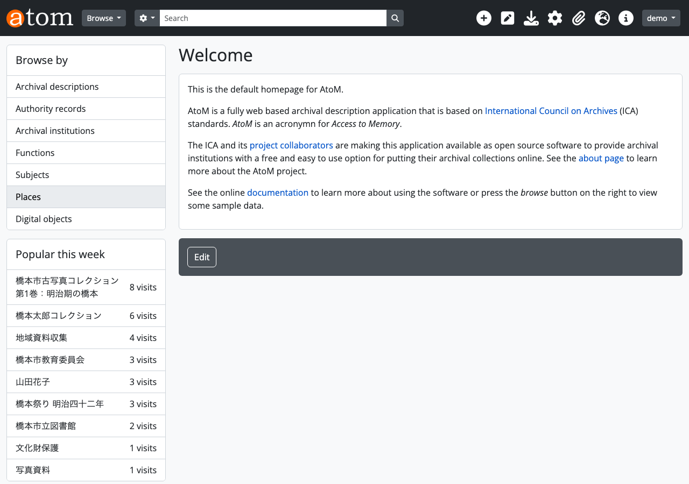

---

### Step 1: 所蔵機関を登録する

橋本市立図書館をアーカイブ所蔵機関として登録します。

```bash
curl -s -X POST \
  -H "REST-API-Key: $API_KEY" \
  -H "Content-Type: application/json" \
  -d '{
    "authorized_form_of_name": "橋本市立図書館",
    "identifier": "hashimoto-library",
    "desc_detail_id": 233,
    "desc_status_id": 230,
    "history": "橋本市立図書館は1965年に設立された公共図書館です。2020年より歴史資料のデジタルアーカイブ事業を開始しました。",
    "geocultural_context": "和歌山県橋本市",
    "mandates": "図書館法に基づく公共図書館",
    "internal_structures": "デジタルアーカイブ室",
    "collecting_policies": "橋本市および周辺地域の歴史資料、古文書、写真資料を収集対象とする。"
  }' \
  $ATOM_URL/api/repositories
```

```json
{
    "id": 466,
    "slug": "ayya-htm3-5wkd"
}
```

`desc_detail_id` と `desc_status_id` はタクソノミー用語のIDです（Step 8で確認方法を説明します）。

**Web UIでの確認**: 所蔵機関一覧

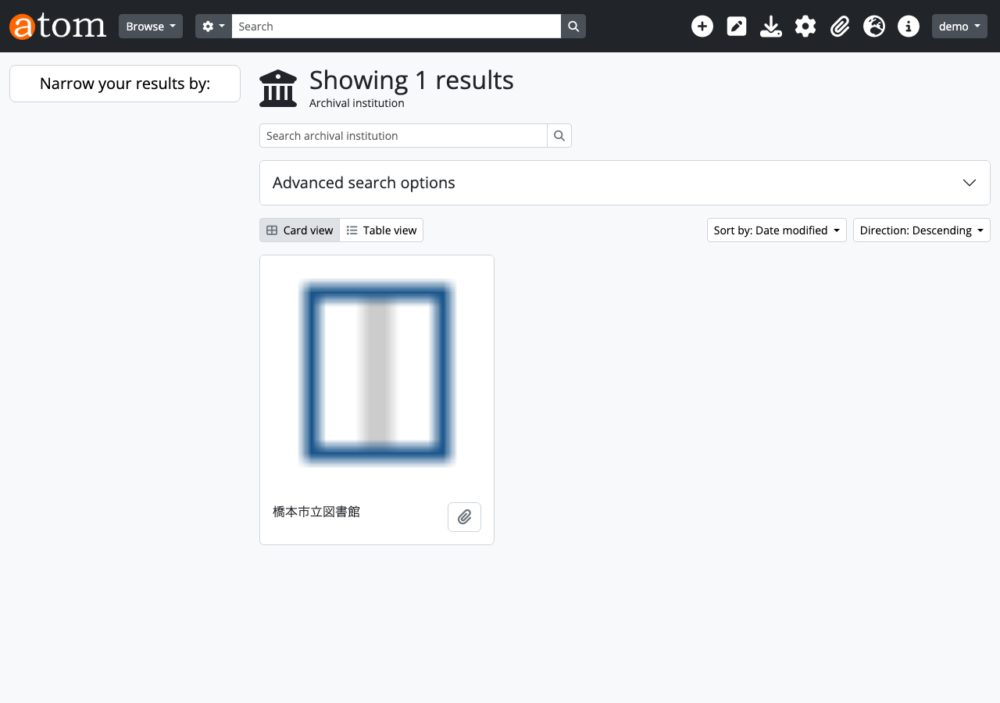

---

### Step 2: 所蔵機関の情報を確認する

作成した所蔵機関の詳細を取得します。

```bash
curl -s -H "REST-API-Key: $API_KEY" \
  $ATOM_URL/api/repositories/ayya-htm3-5wkd | python3 -m json.tool
```

```json
{
    "id": 466,
    "slug": "ayya-htm3-5wkd",
    "identifier": "hashimoto-library",
    "authorized_form_of_name": "橋本市立図書館",
    "history": "橋本市立図書館は1965年に設立された公共図書館です。2020年より歴史資料のデジタルアーカイブ事業を開始しました。",
    "mandates": "図書館法に基づく公共図書館",
    "internal_structures": "デジタルアーカイブ室",
    "geocultural_context": "和歌山県橋本市",
    "collecting_policies": "橋本市および周辺地域の歴史資料、古文書、写真資料を収集対象とする。",
    "upload_limit": -1,
    "desc_status": "Final",
    "desc_detail": "Full",
    "created_at": "2026-02-15 01:33:36",
    "updated_at": "2026-02-15 01:34:50"
}
```

Step 1で指定した全フィールドが正しく登録されています。

**Web UIでの確認**: 所蔵機関詳細ページ


---

### Step 3: 連絡先情報を追加する

所蔵機関に住所・電話番号などの連絡先情報を追加します。

```bash
curl -s -X PUT \
  -H "REST-API-Key: $API_KEY" \
  -H "Content-Type: application/json" \
  -d '{
    "contact_information": {
      "city": "橋本市",
      "region": "和歌山県",
      "country_code": "JP",
      "postal_code": "648-0072",
      "street_address": "東家一丁目6番27号",
      "telephone": "0736-33-0899"
    }
  }' \
  $ATOM_URL/api/repositories/ayya-htm3-5wkd
```

```json
{
    "id": 466,
    "slug": "ayya-htm3-5wkd"
}
```

**Web UIでの確認**: 所蔵機関詳細ページ（連絡先情報付き）

Contact area に住所・電話番号が反映されています。

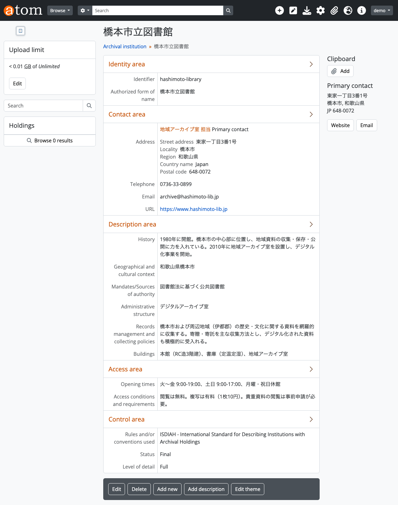

---

### Step 4: 寄贈者（典拠レコード）を登録する

古写真コレクションの寄贈者である山田花子氏を典拠レコードとして登録します。

```bash
curl -s -X POST \
  -H "REST-API-Key: $API_KEY" \
  -H "Content-Type: application/json" \
  -d '{
    "authorized_form_of_name": "山田花子",
    "entity_type_id": 132,
    "history": "橋本市在住の郷土史研究家。2025年に自身が収集した橋本市の古写真コレクション（明治〜昭和期）を橋本市立図書館に寄贈した。",
    "dates_of_existence": "1950年〜",
    "places": "和歌山県橋本市"
  }' \
  $ATOM_URL/api/actors
```

```json
{
    "id": 487,
    "slug": "wmdg-q5q2-4zy2"
}
```

`entity_type_id: 132` は "Person"（個人）を意味します。他に 131=Corporate body（団体）、133=Family（家族）が選択できます。

**Web UIでの確認**: 典拠レコード一覧

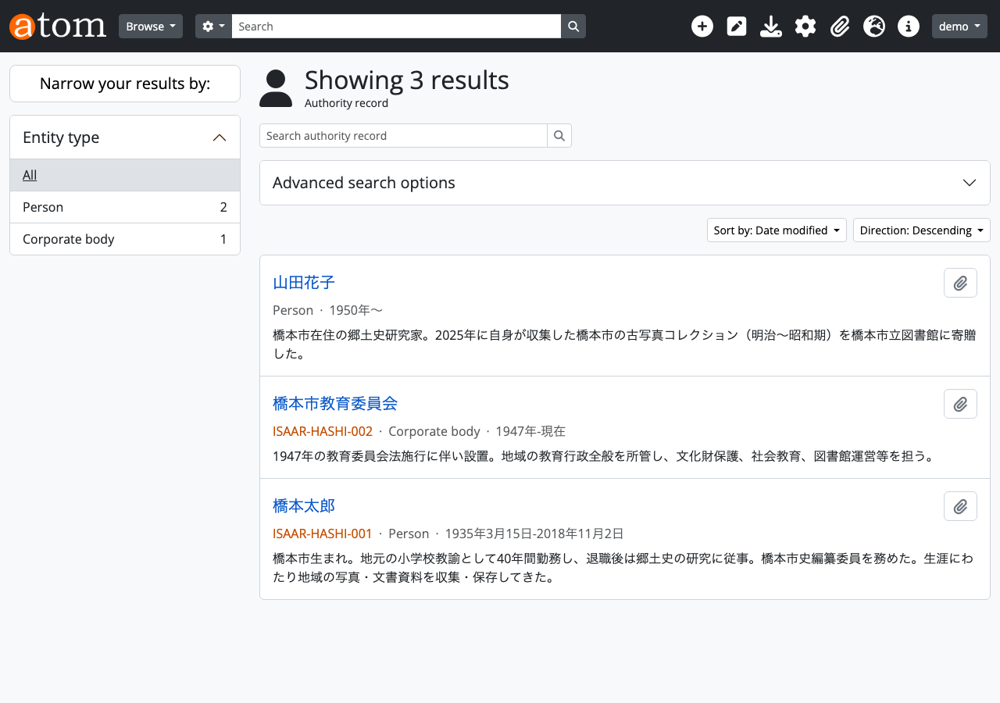

---

### Step 5: 寄贈者の情報を確認する

```bash
curl -s -H "REST-API-Key: $API_KEY" \
  $ATOM_URL/api/actors/wmdg-q5q2-4zy2 | python3 -m json.tool
```

```json
{
    "id": 487,
    "slug": "wmdg-q5q2-4zy2",
    "authorized_form_of_name": "山田花子",
    "dates_of_existence": "1950年〜",
    "history": "橋本市在住の郷土史研究家。2025年に自身が収集した橋本市の古写真コレクション（明治〜昭和期）を橋本市立図書館に寄贈した。",
    "places": "和歌山県橋本市",
    "entity_type": "Person",
    "entity_type_id": 132,
    "created_at": "2026-02-15 01:44:10",
    "updated_at": "2026-02-15 01:44:10"
}
```

**Web UIでの確認**: 典拠レコード詳細ページ

Identity area に「山田花子」「Person」、Description area に「1950年〜」「橋本市在住の郷土史研究家…」「和歌山県橋本市」が表示されています。

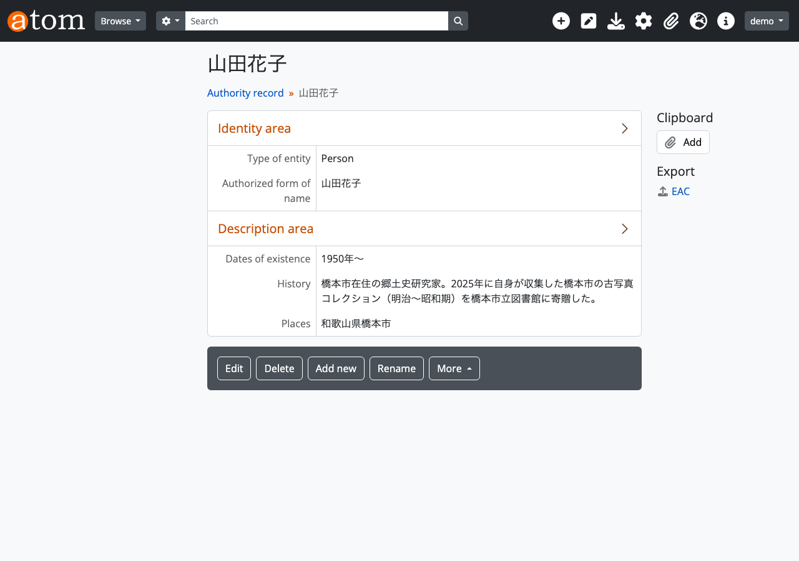

---

### Step 6: 受入記録を作成する

寄贈資料の受入記録（Accession record）を作成します。アーカイブ業務では、資料の受入れを記録・管理するために不可欠な手続きです。

```bash
curl -s -X POST \
  -H "REST-API-Key: $API_KEY" \
  -H "Content-Type: application/json" \
  -d '{
    "identifier": "2026-003",
    "date": "2026-01-15",
    "title": "山田花子寄贈 橋本市古写真コレクション",
    "source_of_acquisition": "山田花子氏（橋本市在住の郷土史研究家）からの寄贈",
    "location_information": "橋本市立図書館 デジタルアーカイブ室 資料保管庫A-3",
    "scope_and_content": "明治後期から昭和30年代にかけての橋本市内の風景・建築物・祭事を撮影した写真コレクション。約200点。銀塩プリントおよびガラス乾板を含む。",
    "appraisal": "橋本市の近代史を記録する一次資料として高い価値を有する。",
    "archival_history": "撮影者は主に山田花子の祖父・山田一郎（1888-1965）。山田家で保管されていたものを花子氏が整理し寄贈。",
    "acquisition_type_id": 332,
    "processing_status_id": 339,
    "resource_type_id": 330,
    "creators": [487]
  }' \
  $ATOM_URL/api/accessions
```

```json
{
    "id": 490,
    "slug": "2026-003",
    "identifier": "2026-003"
}
```

主なフィールドの意味：
- `date`: 受入日（必須項目）
- `source_of_acquisition`: 取得元（必須項目）
- `location_information`: 保管場所（必須項目）
- `acquisition_type_id: 332` → Gift（寄贈）
- `processing_status_id: 339` → Incomplete（未処理）
- `resource_type_id: 330` → Private transfer（個人移管）
- `creators: [487]` → Step 4で作成した山田花子のID

**Web UIでの確認**: 受入記録一覧

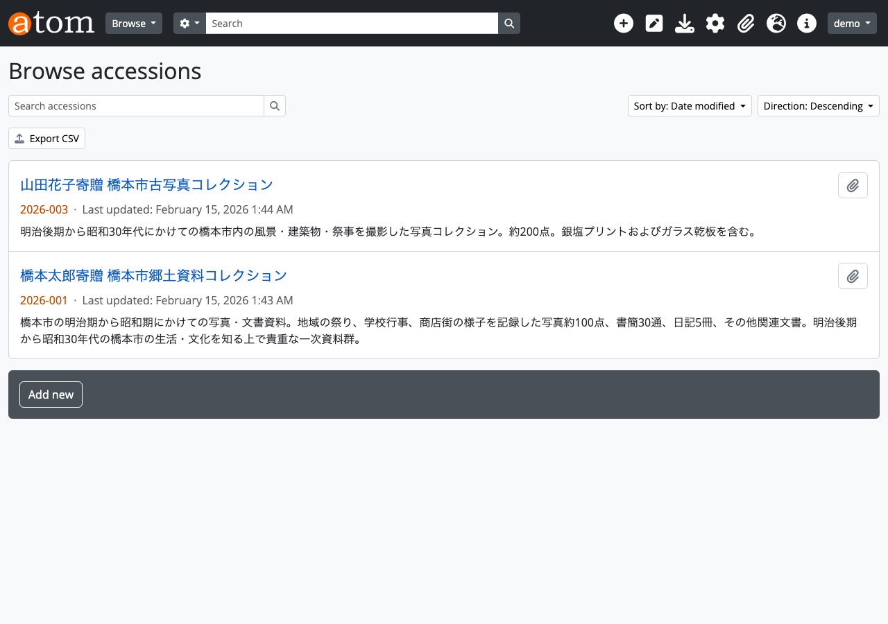

---

### Step 7: 処理ステータスを更新する

デジタル化作業を開始したので、ステータスを "In-Progress" に変更します。

```bash
curl -s -X PUT \
  -H "REST-API-Key: $API_KEY" \
  -H "Content-Type: application/json" \
  -d '{
    "processing_status_id": 340,
    "processing_notes": "2026年2月15日: デジタル化作業開始。まず状態の良い銀塩プリント50点からスキャンを実施。"
  }' \
  $ATOM_URL/api/accessions/2026-003
```

```json
{
    "id": 490,
    "slug": "2026-003",
    "identifier": "2026-003"
}
```

確認:

```bash
curl -s -H "REST-API-Key: $API_KEY" \
  $ATOM_URL/api/accessions/2026-003 | python3 -m json.tool
```

```json
{
    "id": 490,
    "slug": "2026-003",
    "identifier": "2026-003",
    "date": "2026-01-15",
    "title": "山田花子寄贈 橋本市古写真コレクション",
    "source_of_acquisition": "山田花子氏（橋本市在住の郷土史研究家）からの寄贈",
    "location_information": "橋本市立図書館 デジタルアーカイブ室 資料保管庫A-3",
    "scope_and_content": "明治後期から昭和30年代にかけての橋本市内の風景・建築物・祭事を撮影した写真コレクション。約200点。銀塩プリントおよびガラス乾板を含む。",
    "archival_history": "撮影者は主に山田花子の祖父・山田一郎（1888-1965）。山田家で保管されていたものを花子氏が整理し寄贈。",
    "appraisal": "橋本市の近代史を記録する一次資料として高い価値を有する。",
    "processing_notes": "2026年2月15日: デジタル化作業開始。まず状態の良い銀塩プリント50点からスキャンを実施。",
    "acquisition_type": "Gift",
    "acquisition_type_id": 332,
    "processing_status": "In-Progress",
    "processing_status_id": 340,
    "resource_type": "Private transfer",
    "resource_type_id": 330,
    "created_at": "2026-02-15 01:44:35",
    "updated_at": "2026-02-15 02:54:00"
}
```

Processing status が "In-Progress" に、processing_notes にデジタル化作業開始の記録が追加されています。

**Web UIでの確認**: 受入記録詳細ページ

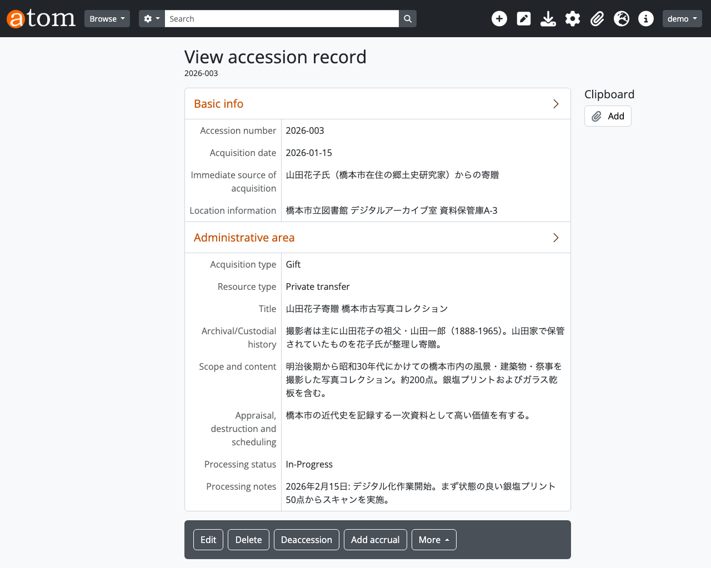

---

### Step 8: タクソノミー（分類語彙）を確認する

AtoMでは、エンティティ種別・記述レベル・受入種別などの値がタクソノミー（分類語彙）として管理されています。これまでのステップで使用した `entity_type_id` や `acquisition_type_id` の値は、すべてタクソノミー用語のIDです。

```bash
curl -s -H "REST-API-Key: $API_KEY" \
  $ATOM_URL/api/taxonomies | python3 -m json.tool
```

```json
{
    "total": 49,
    "results": [
        { "id": 63, "name": "Accession acquisition type" },
        { "id": 65, "name": "Accession processing status" },
        { "id": 62, "name": "Accession resource type" },
        { "id": 32, "name": "Actor Entity Types" },
        { "id": 31, "name": "Description Detail Levels" },
        { "id": 33, "name": "Description Statuses" },
        { "id": 43, "name": "ISDF Function Types" },
        { "id": 34, "name": "Levels of description" },
        { "id": 42, "name": "Places" },
        { "id": 35, "name": "Subjects" },
        "..."
    ]
}
```

よく使うタクソノミー用語IDの対応表：

| タクソノミー | ID | 用語 |
|---|---|---|
| Actor Entity Types (32) | 131 | Corporate body（団体） |
| | 132 | Person（個人） |
| | 133 | Family（家族） |
| Levels of description (34) | 236 | Fonds（フォンド） |
| | 239 | Series（シリーズ） |
| | 242 | Item（アイテム） |
| Description Detail (31) | 233 | Full（完全） |
| | 234 | Partial（部分） |
| Description Status (33) | 230 | Final（最終） |
| | 232 | Draft（下書き） |
| Accession acquisition type (63) | 332 | Gift（寄贈） |
| | 333 | Purchase（購入） |
| Accession processing status (65) | 338 | Complete（完了） |
| | 339 | Incomplete（未処理） |
| | 340 | In-Progress（処理中） |

**Web UIでの確認**: タクソノミー管理画面

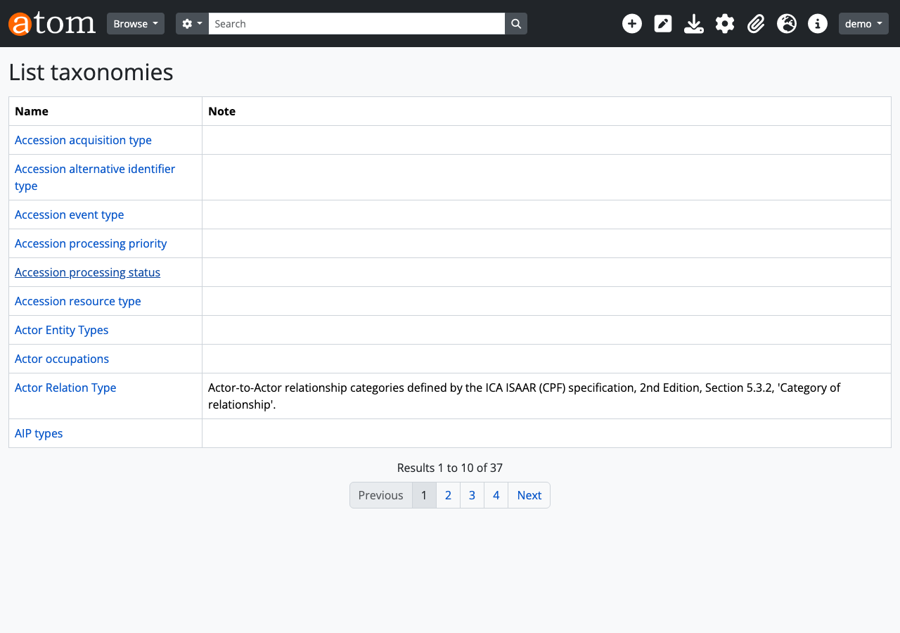

---

### Step 9: 主題分類を追加する

コレクションの主題分類として「古写真」を Subjects タクソノミー（id=35）に追加します。

```bash
curl -s -X POST \
  -H "REST-API-Key: $API_KEY" \
  -H "Content-Type: application/json" \
  -d '{
    "name": "古写真",
    "i18n": {
      "en": { "name": "Historical photographs" }
    }
  }' \
  $ATOM_URL/api/taxonomies/35/terms
```

```json
{
    "id": 495,
    "slug": "historical-photographs",
    "name": "Historical photographs",
    "taxonomy_id": 35
}
```

`i18n` フィールドで多言語対応が可能です。日本語名は作成時のカルチャ設定で自動保存されます。

**Web UIでの確認**: Subjects タクソノミー

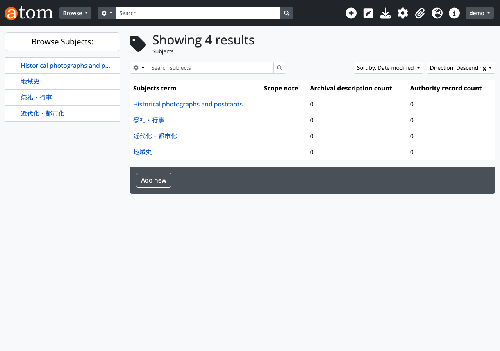

---

### Step 10: 分類名を修正する

用語名をより具体的に変更します。

```bash
curl -s -X PUT \
  -H "REST-API-Key: $API_KEY" \
  -H "Content-Type: application/json" \
  -d '{
    "name": "古写真・絵葉書",
    "i18n": {
      "en": { "name": "Historical photographs and postcards" }
    }
  }' \
  $ATOM_URL/api/taxonomies/terms/495
```

```json
{
    "id": 495,
    "slug": "historical-photographs",
    "name": "Historical photographs and postcards",
    "taxonomy_id": 35
}
```

---

### Step 11: 資料記述を作成する

いよいよ、コレクションの資料記述（Information Object）を作成します。これは既存の `arRestApiPlugin` の API を使います。

```bash
curl -s -X POST \
  -H "REST-API-Key: $API_KEY" \
  -H "Content-Type: application/json" \
  -d '{
    "title": "橋本市古写真コレクション 第1巻：明治期の橋本",
    "identifier": "HASH-PHOTO-001",
    "level_of_description_id": 242,
    "publication_status_id": 160,
    "scope_and_content": "明治30年代から大正初期にかけての橋本市中心部の街並み、紀の川の風景、高野山参詣道の写真など32点を収録。",
    "repository_id": 466
  }' \
  $ATOM_URL/api/informationobjects
```

```json
{
    "id": 470,
    "slug": "1",
    "parent_id": 1
}
```

- `level_of_description_id: 242` → Item（アイテム）
- `publication_status_id: 160` → Published（公開）
- `repository_id: 466` → Step 1 で作成した橋本市立図書館のID

**Web UIでの確認**: 資料記述一覧

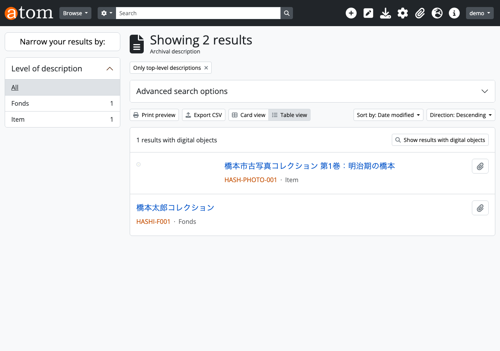

---

### Step 12: デジタル画像を添付する

スキャンした写真画像をbase64エンコードしてアップロードします。

```bash
# 実際にはスキャン画像のbase64を使用
BASE64_IMAGE="iVBORw0KGgoAAAANSUhEUgAAAAEAAAABCAYAAAAfFcSJAAAADUlEQVR42mP8/5+hHgAHggJ/PchI7wAAAABJRU5ErkJggg=="

curl -s -X POST \
  -H "REST-API-Key: $API_KEY" \
  -H "Content-Type: application/json" \
  -d "{
    \"base64\": \"$BASE64_IMAGE\",
    \"filename\": \"hashimoto_meiji_001.png\"
  }" \
  $ATOM_URL/api/informationobjects/1/digitalobject
```

```json
{
    "id": 473,
    "information_object_id": 470,
    "name": "hashimoto_meiji_001.png",
    "mime_type": "image/png",
    "byte_size": 70
}
```

アップロード後、AtoMは自動的に参照用コピー（reference）とサムネイル（thumbnail）を生成します。

URLから直接インポートすることも可能です：

```bash
curl -s -X POST \
  -H "REST-API-Key: $API_KEY" \
  -H "Content-Type: application/json" \
  -d '{
    "url": "https://example.com/images/hashimoto_photo.jpg"
  }' \
  $ATOM_URL/api/informationobjects/:slug/digitalobject
```

**Web UIでの確認**: 資料詳細ページ

Identity area にタイトル「橋本市古写真コレクション 第1巻：明治期の橋本」や識別子「HASH-PHOTO-001」、Digital object metadata にアップロードしたファイルのメタデータが表示されています。Master file、Reference copy、Thumbnail copy が自動生成されていることも確認できます。

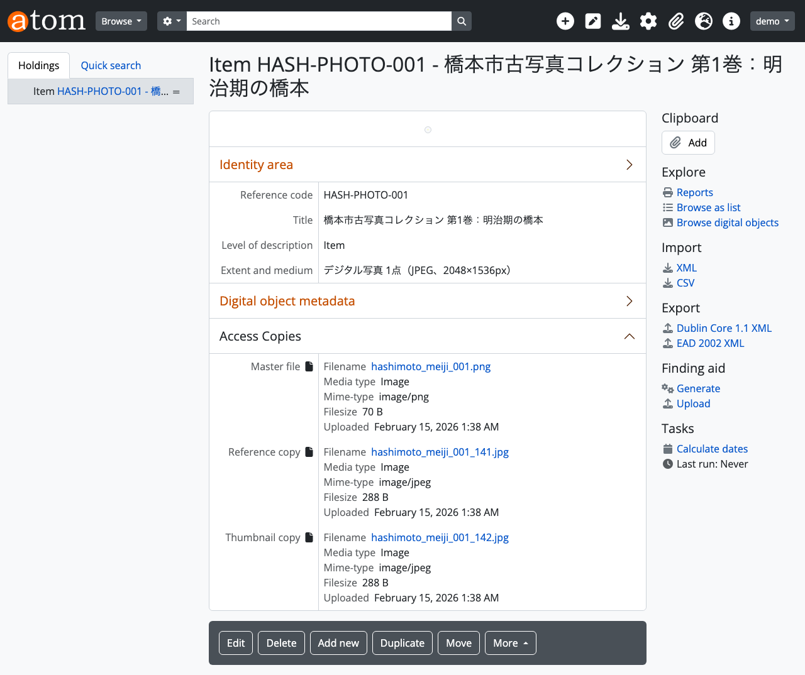

---

### Step 13: 最終状態を確認する

全ステップ完了後のデータ件数を確認します。

```bash
curl -s -H "REST-API-Key: $API_KEY" \
  $ATOM_URL/api/summary | python3 -m json.tool
```

```json
{
    "information_objects": 6,
    "repositories": 1,
    "actors": 12,
    "accessions": 2,
    "terms": 327,
    "digital_objects": 6
}
```

Step 0 の初期状態と比較すると、所蔵機関・典拠レコード・受入記録・資料記述・デジタルオブジェクトが増加しています。

**Web UIでの確認**: トップページ


---

## 追加機能の紹介

基本シナリオに加えて、arExtendedApiPlugin で利用できるその他の機能を紹介します。

### 機能記述（ISDF）の管理

ISDF（International Standard for Describing Functions）に準拠した機能記述を管理できます。アーカイブ機関の業務機能を体系的に記録するための仕組みです。

```bash
# 機能記述の作成
curl -s -X POST \
  -H "REST-API-Key: $API_KEY" \
  -H "Content-Type: application/json" \
  -d '{
    "authorized_form_of_name": "文化財保護",
    "type_id": 323,
    "description_identifier": "ISDF-001",
    "classification": "行政機能 > 教育文化 > 文化財保護",
    "dates": "1950年-現在",
    "description": "文化財保護法に基づき、有形・無形文化財の調査、指定、保存、活用を行う機能。",
    "history": "1950年の文化財保護法制定により体系的な文化財保護行政が開始された。",
    "legislation": "文化財保護法（昭和25年法律第214号）"
  }' \
  $ATOM_URL/api/functions
```

- `type_id: 323` → Function（機能）。他に 324=Subfunction（副機能）が選択可能
- ISDF の各フィールド（classification, dates, description, history, legislation）に対応

**Web UIでの確認**: 機能記述一覧

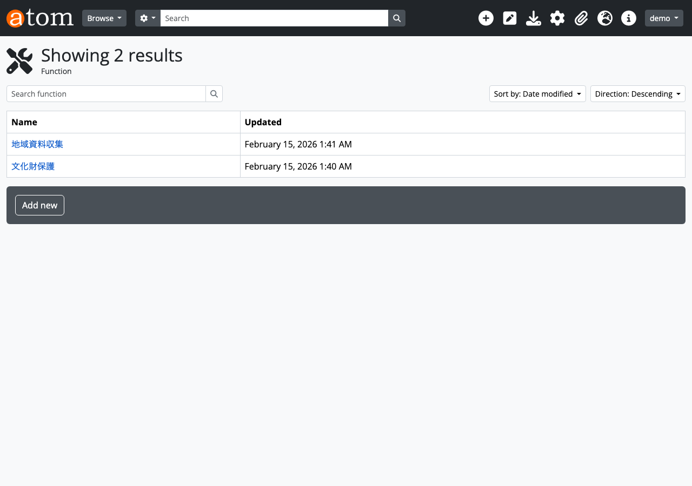

**Web UIでの確認**: 機能記述詳細

Identity area に「文化財保護」「Function」「行政機能 > 教育文化 > 文化財保護」、Context area に日付・説明・法令情報、Control area に Description identifier が表示されています。

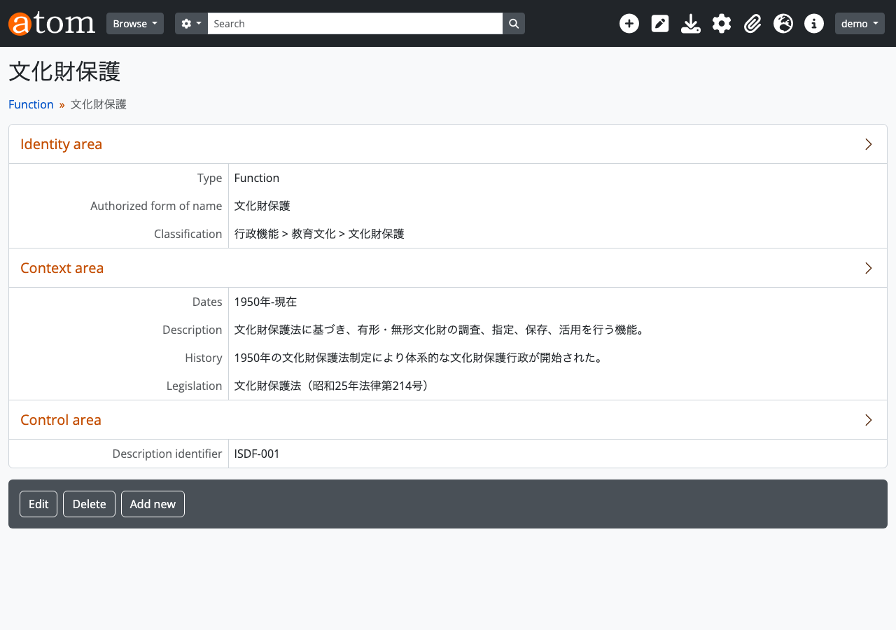

---

### 場所（Places）タクソノミーの管理

主題分類（Subjects）と同様に、場所（Places）タクソノミーにもタームを追加できます。

```bash
# 場所タームの作成
curl -s -X POST \
  -H "REST-API-Key: $API_KEY" \
  -H "Content-Type: application/json" \
  -d '{"name": "和歌山県橋本市"}' \
  $ATOM_URL/api/taxonomies/42/terms
```

**Web UIでの確認**: Places タクソノミー

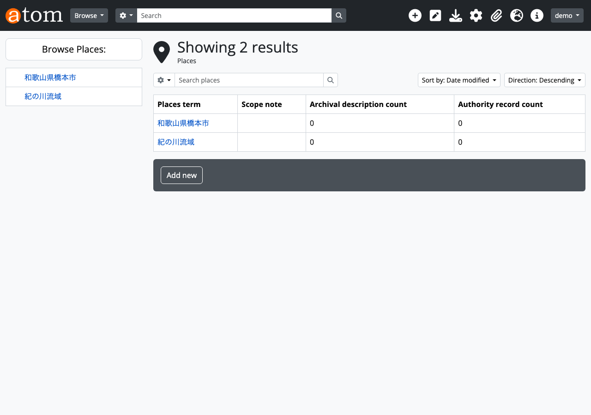

---

### 階層的な資料記述

AtoMでは、Fonds（フォンド）> Series（シリーズ）> Item（アイテム）という階層構造で資料を記述できます。`parent_id` を指定して親子関係を構築します。

```bash
# Fonds（最上位）を作成
curl -s -X POST \
  -H "REST-API-Key: $API_KEY" \
  -H "Content-Type: application/json" \
  -d '{
    "title": "橋本太郎コレクション",
    "identifier": "HASHI-F001",
    "level_of_description_id": 236,
    "publication_status_id": 160,
    "repository_id": 466
  }' \
  $ATOM_URL/api/informationobjects

# Series（子）を作成（parent_id で Fonds に紐付け）
curl -s -X POST \
  -H "REST-API-Key: $API_KEY" \
  -H "Content-Type: application/json" \
  -d '{
    "parent_id": <fonds_id>,
    "title": "写真資料",
    "identifier": "S01",
    "level_of_description_id": 239,
    "publication_status_id": 160
  }' \
  $ATOM_URL/api/informationobjects
```

**Web UIでの確認**: 資料記述詳細（階層ツリー付き）

左側のツリーに Fonds > Series > Item の階層構造が表示されています。

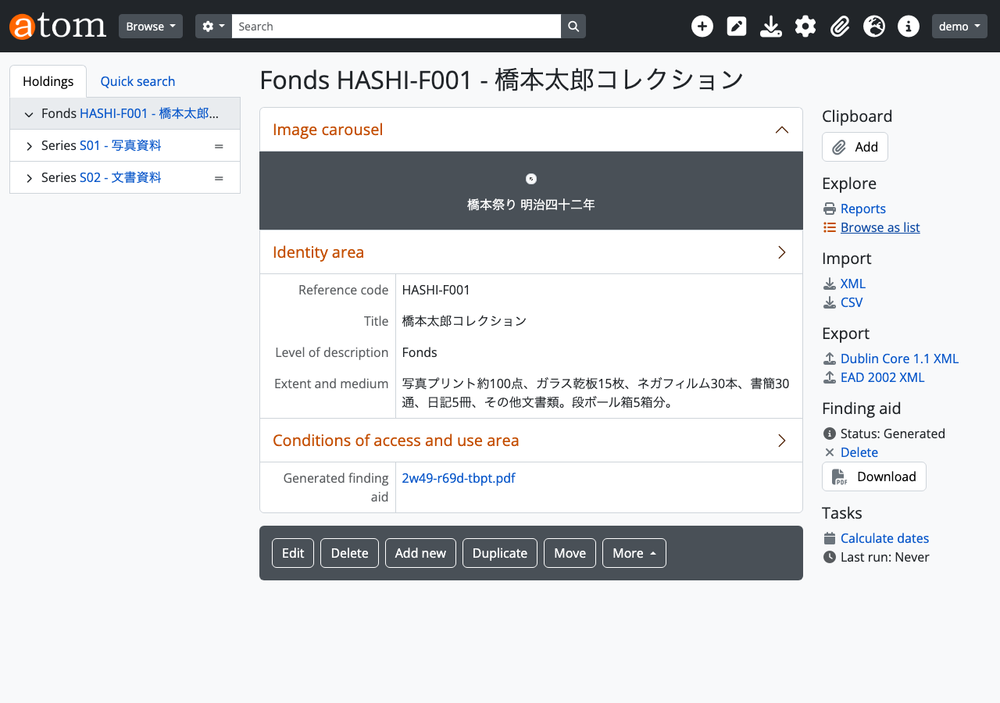

---

### 所蔵機関のロゴ画像

所蔵機関にロゴ画像をアップロードすると、一覧ページでカード表示されます。

```bash
# ロゴ画像のアップロード（base64エンコードしたPNG）
curl -s -X POST \
  -H "REST-API-Key: $API_KEY" \
  -H "Content-Type: application/json" \
  -d '{"base64": "<BASE64_PNG_DATA>"}' \
  $ATOM_URL/api/repositories/ayya-htm3-5wkd/logo
```

**Web UIでの確認**: 所蔵機関一覧（ロゴ付きカード表示）


---

## Web UI 確認URL一覧

各ステップで確認すべきWeb UI画面のURLをまとめます。

| Step | 画面 | URL |
|------|------|-----|
| 0 | トップページ | http://localhost:63001 |
| 1 | 所蔵機関一覧 | http://localhost:63001/index.php/repository/browse |
| 2-3 | 所蔵機関詳細 | http://localhost:63001/index.php/ayya-htm3-5wkd |
| 4 | 典拠レコード一覧 | http://localhost:63001/index.php/actor/browse |
| 5 | 典拠レコード詳細 | http://localhost:63001/index.php/wmdg-q5q2-4zy2 |
| 6 | 受入記録一覧 | http://localhost:63001/index.php/accession/browse |
| 7 | 受入記録詳細 | http://localhost:63001/index.php/2026-003 |
| 8 | タクソノミー一覧 | http://localhost:63001/index.php/taxonomy/browse |
| 9-10 | Subjects タクソノミー | http://localhost:63001/index.php/subjects |
| 11 | 資料記述一覧 | http://localhost:63001/index.php/informationobject/browse |
| 12 | 資料詳細（DO付き） | http://localhost:63001/index.php/1 |
| 13 | トップページ | http://localhost:63001 |
| 追加 | 機能記述一覧 | http://localhost:63001/index.php/function/browse |
| 追加 | Places タクソノミー | http://localhost:63001/index.php/places |
| 追加 | 所蔵機関一覧（ロゴ付き） | http://localhost:63001/index.php/repository/browse |

---

## まとめ

本記事では、図書館のデジタルアーカイブ構築という現実的な業務シナリオに沿って、AtoMのREST APIを一通り試しました。

APIを使うことで：

- **バッチ処理**: 大量の資料データをスクリプトで一括登録できる
- **外部連携**: 他の図書館システム、デジタル化業者のシステムとのデータ連携が容易になる
- **自動化**: 受入→記述→デジタル化→公開の一連のワークフローを自動化できる
- **品質管理**: APIのレスポンスを検証することで、データの整合性チェックを組み込める

AtoMは世界中のアーカイブ機関で利用されている実績あるソフトウェアです。REST APIによる操作を活用することで、より効率的なデジタルアーカイブ運営が実現できます。

---

*本記事の検証環境: AtoM 2.8.x (Docker), PHP 7.4, Percona 8.0, Elasticsearch 5.6*
